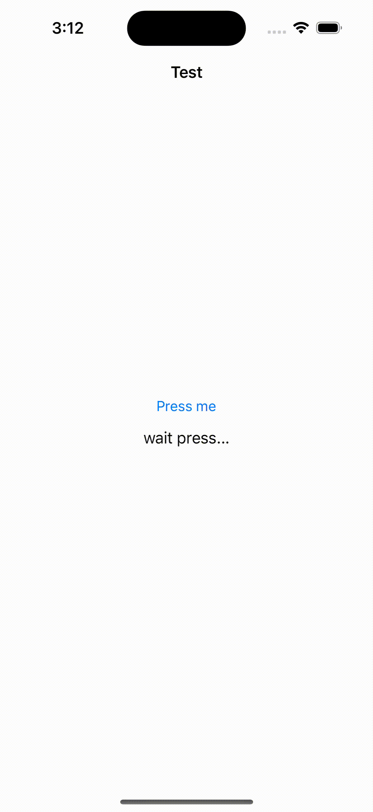

## Demo
- Google Pay


- Apple Pay




[](http://www.apache.org/licenses/LICENSE-2.0) [ ](https://repo1.maven.org/maven2/dev/icerock/moko/permissions) 

# Google and Apple Pay Interface
**khalid-payments** - Kotlin MultiPlatform library for Google (on Android platform only) and Apple (on iOS platform only) Payments.

## Table of Contents
- [Features](#features)
- [Requirements](#requirements)
- [Installation](#installation)
- [Usage](#usage)
- [Samples](#samples)
- [Set Up Locally](#set-up-locally)
- [Contributing](#contributing)
- [License](#license)

## Features
- **Check Availability** - [canMakePayments] (google-apple-payments/com.khalid/multiplatform/googleapple/payments/PaymentsInterface) allows to check is Apple/Google Pay feature is supported.
- **PaymentsInterface** - common interface to interact with Google Wallet api (with lifecycle safety) on Android and PassKit apis on iOS platforms.
- **Compose Multiplatform** support

## Requirements
- Gradle version 6.8+
- Android API 16+
- iOS version 11.0+

## Installation
root **build.gradle**
```groovy
allprojects {
    repositories {
      mavenCentral()
    }
}
```

project **build.gradle**
```groovy
dependencies {
    commonMainApi("com.khalid.payments:googleapple:0.17.0")
    
    // compose multiplatform
    commonMainApi("com.khalid.payments:googleapple-compose:0.17.0") // permissions api + compose extensions
}
```

## List of supported permissions

## Usage

Common code:
```kotlin
class ViewModel(val paymentsInterface: PaymentsInterface): ViewModel() {
    fun checkIfPaymentsAvailable() {
        viewModelScope.launch {
            paymentsInterface.canMakePayments()
        }
    }
}
```

Android:
```kotlin
override fun onCreate(savedInstanceState: Bundle?) {
    super.onCreate(savedInstanceState)

    private val paymentConfig = PaymentConfig(
            gateway = "example",
            gatewayMerchantId = "exampleGatewayMerchantId",
            merchantName = "<merchantName>",
            countryCode = "SG",
            currencyCode = "SDG",
            allowedCards = listOf(
                AllowedCards.AMEX,
                AllowedCards.VISA,
                AllowedCards.MASTERCARD,
                AllowedCards.JCB,
                AllowedCards.DISCOVER,
            ),
            supportedCards = listOf(
                SupportedCardMethods.PAN_ONLY,
                SupportedCardMethods.CRYPTOGRAM_3DS)
        )
        
    val viewModel = getViewModel {
        // Pass the platform implementation of the permission controller to a common code.
        ViewModel(GooglePaymentsImpl(context, paymentConfig))
    }
    viewModel.permissionsController.bind(lifecycle, supportFragmentManager)
}
```

Compose:
```kotlin
@Composable
fun TestScreen() {
    private val paymentConfig = PaymentConfig(
            gateway = "example",
            gatewayMerchantId = "exampleGatewayMerchantId",
            merchantName = "merchantName",
            countryCode = "SG",
            currencyCode = "SDG",
            allowedCards = listOf(
                AllowedCards.AMEX,
                AllowedCards.VISA,
                AllowedCards.MASTERCARD,
                AllowedCards.JCB,
                AllowedCards.DISCOVER,
            ),
            supportedCards = listOf(
                SupportedCardMethods.PAN_ONLY,
                SupportedCardMethods.CRYPTOGRAM_3DS)
        )

    val model = getViewModel {
                    SampleViewModel(
                        paymentInterface = GooglePayModelImpl(this, paymentConfig)
                    )
                }.also {
                    it.paymentInterface.bind(lifecycle, supportFragmentManager)
                }
}
```

iOS:
```swift
// Just pass the platform implementation of the permission controller to a common code.
let viewModel = ViewModel(paymentInterface: ApplePaymentsImpl())
```

### Compose Multiplatform
```kotlin
@Composable
fun Sample() {
    // Google or Apple Config
    private val paymentConfig = PaymentConfig(
            gateway = "example",
            gatewayMerchantId = "exampleGatewayMerchantId",
            merchantName = "merchantName",
            countryCode = "SG",
            currencyCode = "SDG",
            allowedCards = listOf(
                AllowedCards.AMEX,
                AllowedCards.VISA,
                AllowedCards.MASTERCARD,
                AllowedCards.JCB,
                AllowedCards.DISCOVER,
            ),
            supportedCards = listOf(
                SupportedCardMethods.PAN_ONLY,
                SupportedCardMethods.CRYPTOGRAM_3DS)
        )
    val factory: PermissionsControllerFactory = rememberPaymentInterfaceFactory()
    val paymentInterface: PaymentInterface = remember(factory) { factory.createPaymentClient(paymentConfig) }
    val coroutineScope: CoroutineScope = rememberCoroutineScope()
    
    Button(
        onClick = {
            coroutineScope.launch {
                paymentInterface.makePayments("100") // payment of 100 SGD
            }
        }
    ) {
        Text(text = "Make Payment")
    }
}
```

Or with `moko-mvvm` with correct configuration change handle on android:
```kotlin
@Composable
fun Sample() {
    val factory: PaymentInterfaceFactory = rememberPaymentInterfaceFactory()
    val viewModel: PaymentViewModel = getViewModel(
        key = "payment-screen",
        factory = viewModelFactory { PermissionsViewModel(factory.createPaymentClient(paymentConfig)) }
    )
    
    BindEffect(viewModel.paymentInterface)

    Button(onClick = viewModel::onButtonClick) {
        Text(text = "give permissions")
    }
}

class PaymentViewModel(
    val paymentInterface: PaymentInterface
) : ViewModel() {
    fun onButtonClick() {
        viewModelScope.launch {
            paymentInterface.makePayments("100")
        }
    }
}
```

## Samples
More examples can be found in the [sample directory](sample).

## Set Up Locally 
- In [google-apple-payments directory](payments) contains `google-apple-payments` library;
- In [sample directory](sample) contains samples on android, ios & mpp-library connected to apps.

## Contributing
All development (both new features and bug fixes) is performed in `develop` branch. This way `master` sources always contain sources of the most recently released version. Please send PRs with bug fixes to `develop` branch. Fixes to documentation in markdown files are an exception to this rule. They are updated directly in `master`.

The `develop` branch is pushed to `master` during release.

More detailed guide for contributers see in [contributing guide](CONTRIBUTING.md).

## License
        
    Copyright 2019 IceRock MAG Inc
    
    Licensed under the Apache License, Version 2.0 (the "License");
    you may not use this file except in compliance with the License.
    You may obtain a copy of the License at
    
       http://www.apache.org/licenses/LICENSE-2.0
    
    Unless required by applicable law or agreed to in writing, software
    distributed under the License is distributed on an "AS IS" BASIS,
    WITHOUT WARRANTIES OR CONDITIONS OF ANY KIND, either express or implied.
    See the License for the specific language governing permissions and
    limitations under the License.
